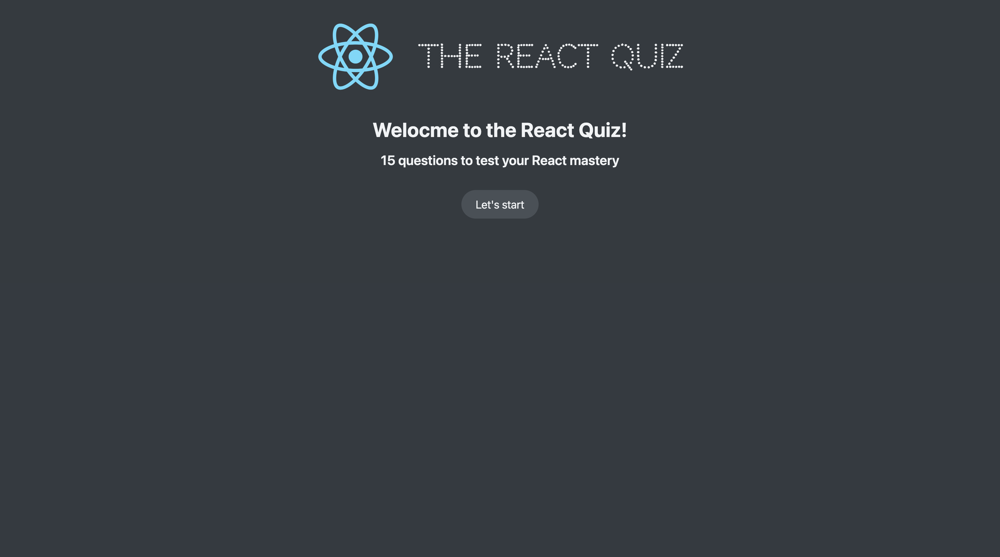
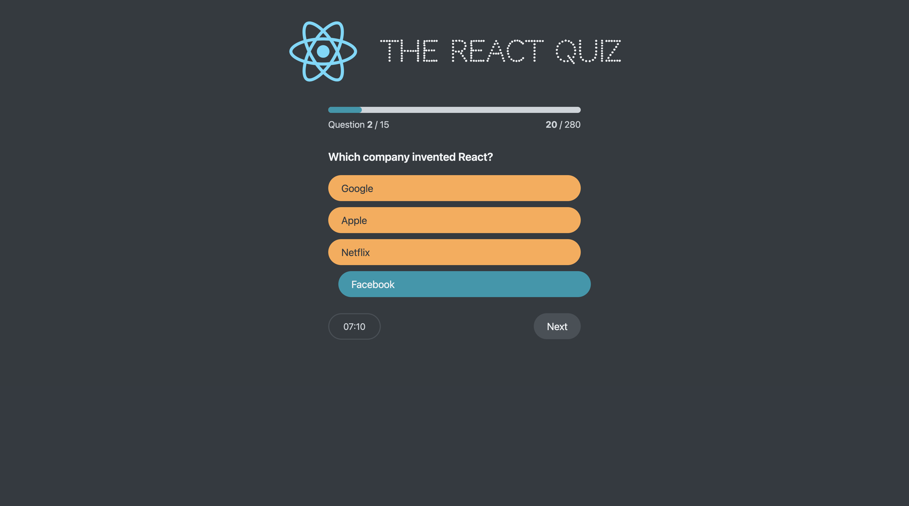
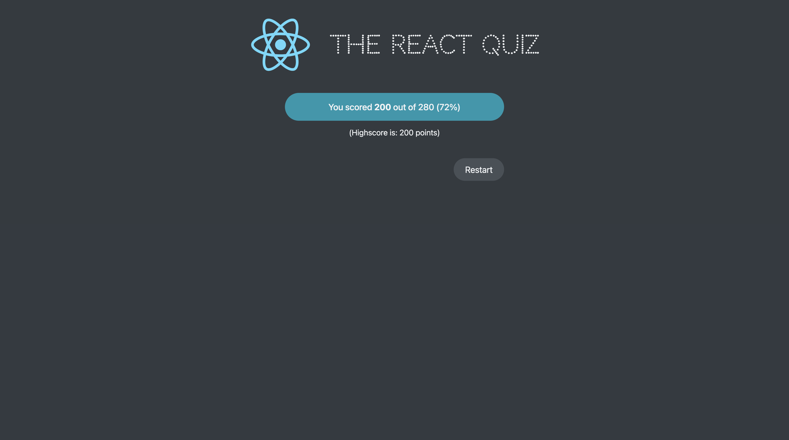

# React Quiz App 🎯

A lightweight quiz application built with **React** and powered by **JSON Server** as a mock backend. Users can take quizzes based on questions fetched from a local JSON file served through an API.

---

## 📸 Preview

### 🟢 Start screen


### ❓ First question


### ✅ Answer selected


### 🏁 Result screen


---

## 🚀 Features

- Interactive multiple-choice quiz
- Tracks correct/incorrect answers
- Fetches question data from mock API (JSON Server)
- Component-based structure with React Hooks and Context API

---

## 🛠 Technologies Used

- **React** (Create React App)
- **JSON Server** (mock REST API)
- **JavaScript (ES6+)**
- **CSS Modules**

---

## 📁 Project Structure
react-quiz/
├── data/
├── public/
├── src/
│   ├── components/
│   ├── contexts/
│   ├── data/
│   ├── index.js
│   └── index.css
├── package.json
└── README.md

---

## 🔧 Getting Started

### 1. Clone the repo

```bash
git clone https://github.com/KuPiSzzz/react-quiz.git
cd react-quiz
```

### 2. Install dependencies

```bash
npm install
```

### 3. Start the mock API server

The project uses JSON Server to simulate a backend. You can start it with:

```bash
npm run server
```
This will start a local REST API at: http://localhost:9000/questions

### 4. Start the React app

To launch the React frontend:

```bash
npm start
```

The app will be available at: http://localhost:3000


